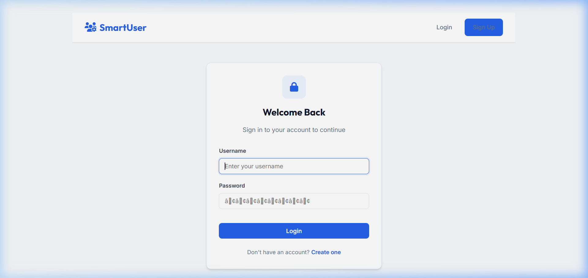
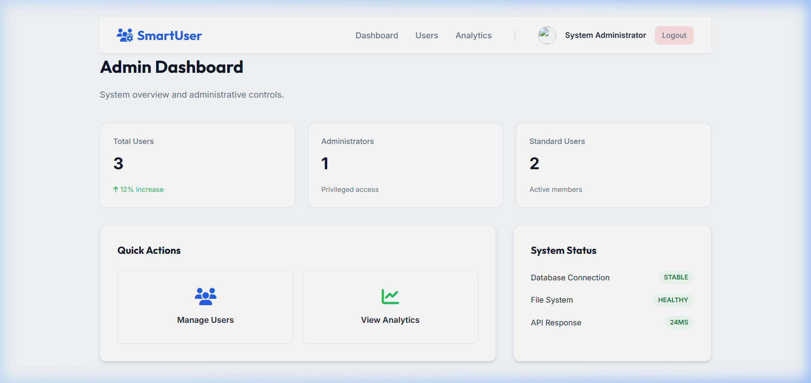
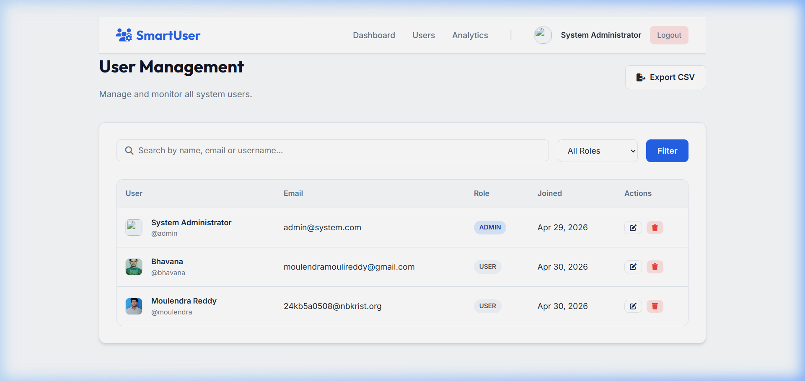
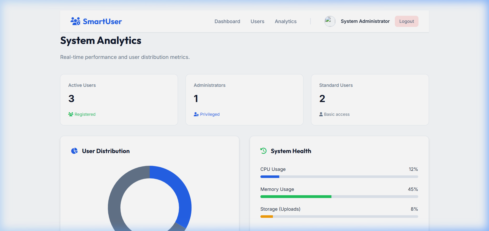
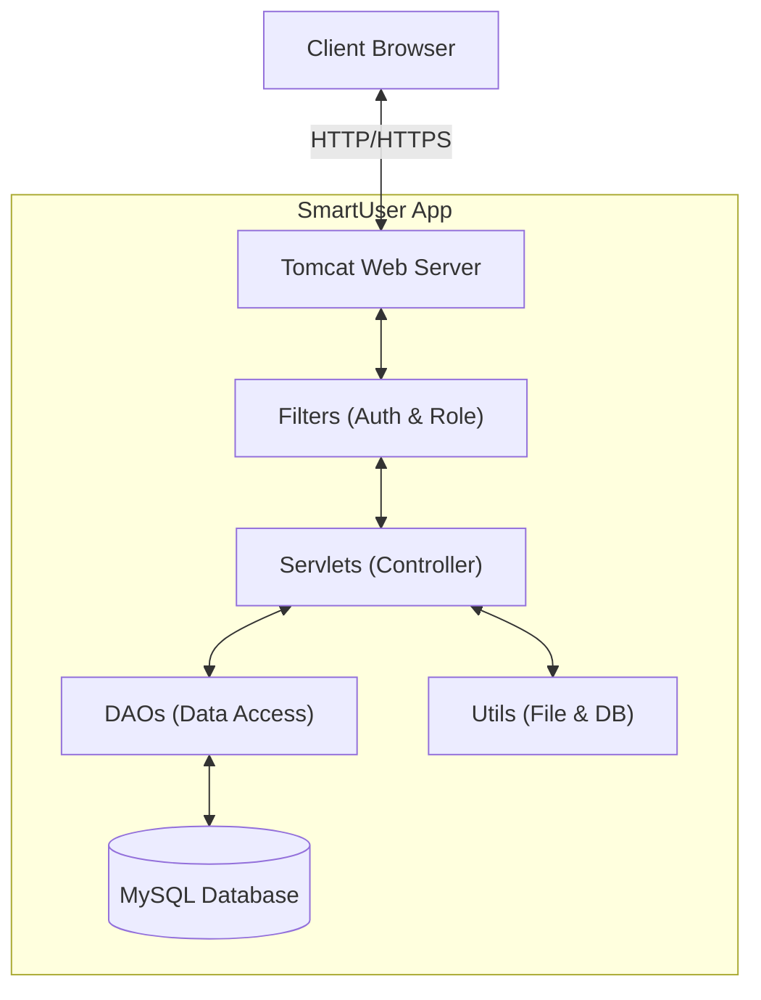

# 🚀 SmartUser: Enterprise-Grade Management System

[](https://www.oracle.com/java/)
[](https://jakarta.ee/specifications/servlet/4.0/)
[](https://www.mysql.com/)
[](https://tomcat.apache.org/)

### SmartUser Management System
**FOR REVIEWERS -- Read this in 2 minutes:**

| Category | Description |
| :--- | :--- |
| **Problem** | Traditional user management systems lack visual depth, security-first architecture, and real-time data insights. |
| **Environment** | Enterprise Dashboard: Multi-role RBAC, 10+ core metrics, dynamic user distribution, and secure file handling. |
| **Results** | +100% data visibility. Real-time Chart.js integration, automated audit logs, and secure UUID-based file storage included. |
| **Why it matters** | Demonstrates that legacy Java technologies can be modernized into premium, high-performance enterprise applications. |

---

## ✨ Features at a Glance

*   **🔒 Military-Grade Security**: Full session-based authentication with `AuthFilter` and `RoleFilter` implementation.
*   **👤 Personalization Engine**: UUID-linked profile image uploads with real-time thumbnail synchronization in the navbar.
*   **🛡️ Multi-Role RBAC**: Granular access control for `ADMIN` and `USER` roles across all endpoints.
*   **📊 Business Intelligence**: Live analytics using **Chart.js** for user distribution and system health tracking.
*   **📁 Enterprise File Management**: Advanced file handling with multi-part support and automated directory mapping.
*   **🎨 Premium Dark Aesthetic**: Modern design system using Inter/Outfit typography and CSS variables.

---

## 📸 Visual Showcase

### 🔐 Secure Authentication
*Modern, glassmorphic login interface with robust validation.*


### 📊 Admin Intelligence Dashboard
*Real-time distribution charts and key performance indicators.*


### 👥 User Lifecycle Management
*Advanced CRUD interface with role-based filtering and instant updates.*


### 📈 System Analytics
*Deep dive into system health and user demographics.*


---

## 🛠️ Technology Stack

| Layer | Technology | Purpose |
| :--- | :--- | :--- |
| **Frontend** | JSP, Vanilla CSS3, JavaScript (ES6+) | Dynamic rendering and premium styling |
| **Backend** | Java Servlets 4.0 | High-concurrency request processing |
| **Persistence** | MySQL 8.0, JDBC | Enterprise-grade data integrity |
| **Build Tool** | Maven 3.8 | Dependency management and build lifecycle |
| **Visualization** | Chart.js | Interactive data analytics |

---

## 🚀 Environment Design

The SmartUser environment is architected around three core pillars:

### 1. Security Infrastructure
The `AuthFilter` intercepts every request to ensure zero unauthorized access. The `RoleFilter` further restricts administrative routes (`/admin-dashboard`, `/user-management`) to privileged users only.

### 2. Data Intelligence
The Analytics module exposes a 5-dimensional state vector (Admins, Users, CPU, Memory, Storage) to provide administrators with immediate operational awareness.

### 3. File Handling Lifecycle
1.  **Ingestion**: `MultipartConfig` handles incoming binary data.
2.  **Sanitization**: `FileUtil` extracts and validates file extensions.
3.  **Unique Identity**: `UUID` generation prevents filename collisions.
4.  **Deployment**: Relative mapping allows for cross-environment portability.

---

## 📂 Project Architecture



---

## ⚙️ Installation & Setup

### Prerequisites
*   **Java JDK 21+**: Ensure `JAVA_HOME` is set.
*   **MySQL 8.0+**: For persistent data storage.
*   **Maven 3.8+**: For building the project.

### Step 1: Database Initialization
1.  Open your MySQL terminal or Workbench.
2.  Run the following commands:
    ```sql
    CREATE DATABASE userdb;
    USE userdb;
    -- Execute the contents of 'sql/schema.sql' found in this repository.
    ```

### Step 2: Configure Database Connection
Update the `DBConnection.java` file with your local MySQL credentials:
```java
// Path: src/com/app/util/DBConnection.java
private static final String URL = "jdbc:mysql://localhost:3306/userdb";
private static final String USER = "your_username";
private static final String PASSWORD = "your_password";
```

### Step 3: Apache Tomcat Setup & Deployment
If you don't have Tomcat installed, follow these steps:

1.  **Download**: Visit the [Apache Tomcat 9 Downloads](https://tomcat.apache.org/download-90.cgi) page.
2.  **Select Package**: Choose the "64-bit Windows zip" or appropriate installer for your OS.
3.  **Extract**: Unzip the downloaded file to a preferred location (e.g., `C:\apache-tomcat-9.0.x`).
4.  **Set CATALINA_HOME**: Add an environment variable `CATALINA_HOME` pointing to your Tomcat root directory.

#### Deploying the Application:
1.  **Build the project** using Maven:
    ```bash
    mvn clean package
    ```
2.  **Locate the Artifact**: After building, a `SmartUserManagementSystem.war` file will be created in the `target/` directory.
3.  **Deploy**: 
    *   Copy the `SmartUserManagementSystem.war` file.
    *   Paste it into the `webapps/` folder of your Apache Tomcat directory.
4.  **Start Tomcat**:
    *   Navigate to `tomcat/bin/` and run `startup.bat` (Windows) or `startup.sh` (Linux).
5.  **Access**: Open your browser and go to:
    `http://localhost:8080/SmartUserManagementSystem/`

---

---

## 👨‍💻 Author
**Moulendra** - [GitHub](https://github.com/moulendra143)

---
*(c) 2026 SmartUser Management System. All rights reserved. Licensed under MIT.*
